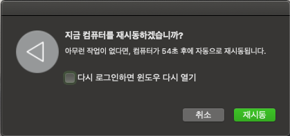
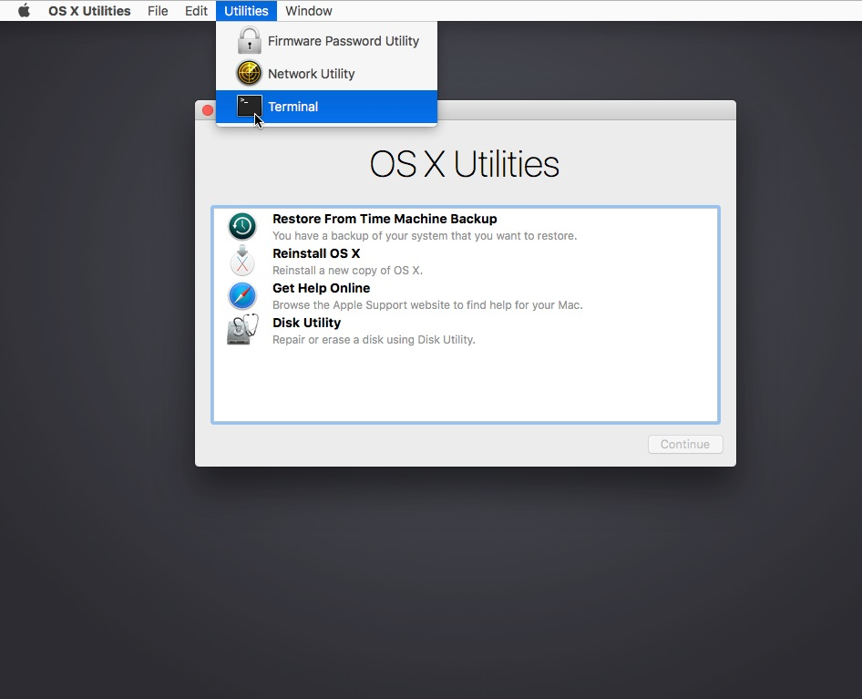
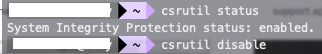
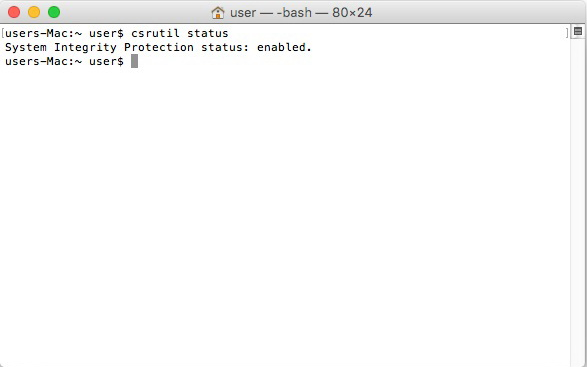

# -mac-os-_catalina-csrutil-disable-issue

## I am currently using macbook pro 2018.

It seems to be a problem with the C type hub or the MacBook library.

This is because the display is purple.

So after accessing the system file after reboot using the existing method csrutil disable, I could not get the modify permission.

When I contacted the Apple customer service in Korea, the staff at the time of the catalina update told me: It looks like you've prevented system files from being modified. Thus, the problem could not be solved.

To solve this problem, the following method was used.

<u>If anyone has the same problem as me, I hope it will be solved.</u>

## step_01 ) 다음과 같이 mac os 를 재시동 하십시오. 
## Restart mac os as follows:
## After the display screen exits, press Command + R continuously.
## This will put you in mac os rescue mode.

## step_02 ) Enter the following command. (The theme of the recovery mode is different from the picture.)

## It is important. Then enter reboot command and press command + R again to enter recovery mode.

## step_03 ) By typing command again. Check the status.

## step_04 ) 

<h2><b><u>All file operations must be done using the command in recovery mode.
 (ex) cp, rm, mv .... 
 

As shown in the picture above, there are System files in both paths. Only in the path of the first picture of Step_04.
</u></b></h2>

<h1> <i>Keep in mind. Only available in mac os recovery mode terminal.</i></h1>

